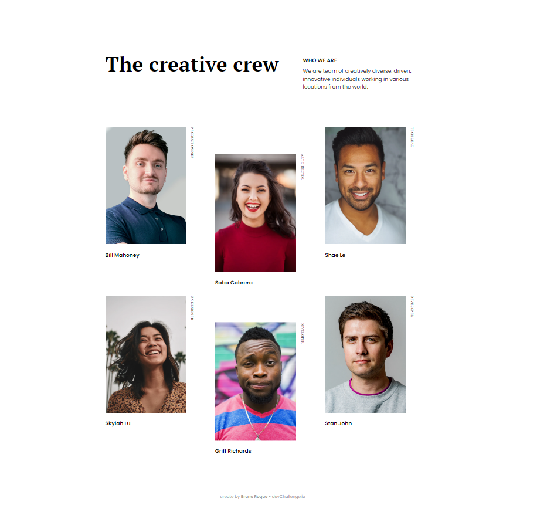
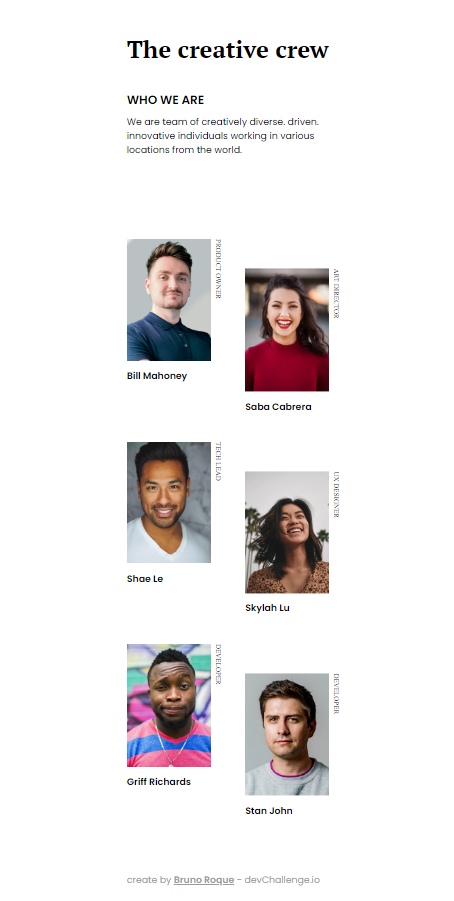

<!-- Please update value in the {}  -->

<h1 align="center">My Team Page</h1>

   Solution for a challenge from  <a href="http://devchallenges.io" target="_blank">Devchallenges.io</a>.

  <h3>
    <a href="https://{}">
      Demo
    </a>
     | 
    <a href="https://{}">
      Solution
    </a>
     | 
    <a href="https://devchallenges.io/challenges/hhmesazsqgKXrTkYkt0U">
      Challenge
    </a>
  </h3>

<!-- TABLE OF CONTENTS -->

## Table of Contents

- [Overview](#overview)
- [Built With](#built-with)
- [Contact](#contact)

<!-- OVERVIEW -->

## Overview

<figure>

;
<figcaption>Desktop Version</figcaption>
</figure>

 

<figure>

;
<figcaption>Mobile Version</figcaption>
</figure>

 

- You can see a demo by clicking on the link: <a href="" target="_blanck">My Team Page</a>
- acquired experiences:
  - Structure and semantics in HTML;
  - Control of layout elements with CSS Grid and Flexbox;
  - Using pseudo-classes to manipulate layout elements;
  - Using media queries for responsive layout.

### Built With
- HTML.
- CSS.

## Contact
- GitHub [@broquedev]( https://github.com/broquedev);
